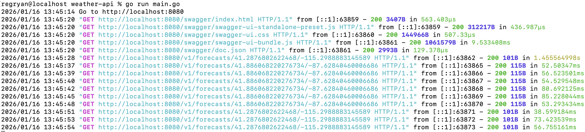
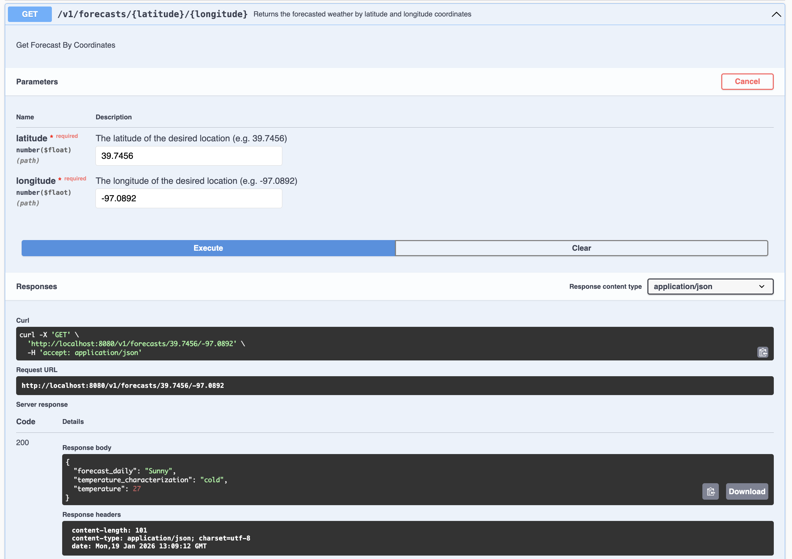

[](https://codecov.io/github/rmccullagh/weather-api)

# Weather API
An HTTP server that serves the forecasted weather. Quick start:


```bash
go run main.go
```




## Documentation
The API is documented in Swagger. After starting the server, open this link in your browser:

```
http://localhost:8080/swagger/index.html
```




## Examples

Request
```bash
curl 'http://localhost:8080/v1/forecasts/41.2876802622468/-115.2988883145589'
```
Response
```
{
  "forecast_daily": "Sunny",
  "temperature": 42,
  "temperature_characterization": "cold"
}
```

Request
```bash
curl 'http://localhost:8080/v1/forecasts/41.886068220276734/-87.62840460006686'
```
Response
```
{
    "forecast_daily": "Chance Snow Showers",
    "temperature": 36,
    "temperature_characterization": "cold"
}
```

## Unit Tests:
```bash
go test ./...
```

## Coverage
```bash
make coverage
```

## Project Requirements
1. Accepts latitude and longitude coordinates
2. Returns the short forecast for that area for Today
3. Returns a characterization of whether the temperature is hot, cold, or moderate
4. Use the National Weather Service API Web Service as a data source.


## TODO
1. Cache responses to decrease latency of API for known responses
